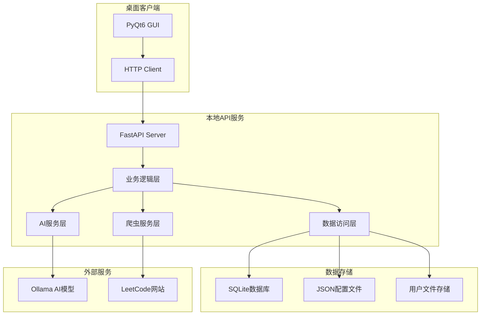

## 产品概述

程序员面试助手是一个综合性的跨平台应用，旨在帮助程序员全方位提升面试竞争力。采用前后端分离架构，现阶段提供桌面应用，未来扩展Android移动端，为用户提供一站式的面试准备解决方案。

## 核心功能

- **简历整理模块**：提供多种简历模板，结合AI技术进行简历优化建议，支持针对特定JD进行定制化调整，实现多版本管理和PDF导出功能
- **LeetCode刷题系统**：自动爬取LeetCode题目，支持题目分类管理，提供用户自定义学习计划，记录代码提交结果并支持定期回顾
- **八股文练习系统**：涵盖算法与数据结构、操作系统、计算机网络、数据库、编程语言基础、系统设计、框架相关、项目经验等八大知识分类，支持每日提问、语音录制回答和AI智能分析点评
- **面试总结模块**：提供面试问题记录、回答情况分析、改进方向建议等功能，帮助用户持续优化面试表现
- **进度跟踪系统**：全面的数据统计分析，包括刷题统计、知识点掌握度、面试表现趋势、薄弱环节分析、时间投入统计、成长曲线等多维度数据展示

## 技术栈选择

### 后端技术栈

- **开发语言**：Python 3.8+
- **Web框架**：FastAPI（高性能异步框架，支持自动API文档生成）
- **数据存储**：SQLite（本地轻量级数据库）+ JSON配置文件
- **AI服务**：Ollama + LLaMA2/ChatGLM（本地大模型部署）
- **网络爬虫**：requests + BeautifulSoup4 + selenium（LeetCode数据获取）
- **语音处理**：pyaudio + speech_recognition + pyttsx3
- **PDF生成**：reportlab + weasyprint
- **数据分析**：pandas + numpy

### 前端技术栈

- **桌面框架**：PyQt6（现代化UI组件，丰富的图表支持）
- **HTTP客户端**：requests（与后端API通信）
- **图表组件**：matplotlib + seaborn（嵌入PyQt）
- **富文本编辑**：QTextEdit + QWebEngineView

## 实现方案

### 架构设计

采用前后端分离的微服务架构，确保代码的可维护性和跨平台扩展性：



### 核心技术实现

- **API设计**：RESTful API设计，支持CRUD操作，使用Pydantic进行数据验证
- **异步处理**：FastAPI原生支持异步，AI推理和网络请求使用异步处理避免阻塞
- **数据持久化**：用户数据使用SQLite存储，配置信息使用JSON文件
- **本地AI集成**：通过Ollama部署本地大模型，确保数据隐私和离线使用
- **模块化设计**：前后端完全分离，业务逻辑模块化，便于维护和扩展

## 实现细节

### 性能优化

- **数据库优化**：合理设计索引，使用连接池管理数据库连接
- **缓存策略**：LeetCode题目数据和AI分析结果进行本地缓存，减少重复计算
- **异步处理**：耗时操作（AI推理、网络爬取）使用异步处理，保持UI响应性
- **分页加载**：大数据量列表采用分页加载，提升界面响应速度

### 安全可靠性

- **数据备份**：自动备份用户数据，支持数据导入导出
- **错误处理**：完善的异常处理机制，API统一错误响应格式
- **日志系统**：详细的操作日志，便于问题排查和用户行为分析
- **数据验证**：使用Pydantic进行严格的数据验证和序列化

## 目录结构

### 后端服务结构

```
backend/
├── main.py                     # FastAPI应用入口
├── app/
│   ├── __init__.py
│   ├── api/
│   │   ├── __init__.py
│   │   ├── resume.py          # 简历相关API
│   │   ├── leetcode.py        # LeetCode相关API
│   │   ├── interview.py       # 面试相关API
│   │   └── analytics.py       # 数据分析API
│   ├── core/
│   │   ├── __init__.py
│   │   ├── config.py          # 配置管理
│   │   └── database.py        # 数据库连接
│   ├── models/
│   │   ├── __init__.py
│   │   ├── resume.py          # 简历数据模型
│   │   ├── problem.py         # 题目数据模型
│   │   └── interview.py       # 面试记录模型
│   ├── services/
│   │   ├── __init__.py
│   │   ├── ai_service.py      # AI分析服务
│   │   ├── crawler_service.py # 爬虫服务
│   │   └── voice_service.py   # 语音处理服务
│   └── utils/
│       ├── __init__.py
│       ├── pdf_generator.py   # PDF生成工具
│       └── file_handler.py    # 文件处理工具
├── data/
│   ├── templates/             # 简历模板
│   ├── questions/             # 八股文题库
│   └── user_data/             # 用户数据目录
└── requirements.txt           # 后端依赖
```

### 前端应用结构

```
frontend/
├── main.py                    # PyQt应用入口
├── gui/
│   ├── __init__.py
│   ├── main_window.py         # 主窗口
│   ├── components/
│   │   ├── __init__.py
│   │   ├── resume_editor.py   # 简历编辑组件
│   │   ├── problem_list.py    # 题目列表组件
│   │   └── analytics_chart.py # 数据图表组件
│   └── dialogs/
│       ├── __init__.py
│       ├── settings_dialog.py # 设置对话框
│       └── voice_recorder.py  # 语音录制对话框
├── services/
│   ├── __init__.py
│   └── api_client.py          # API客户端
├── utils/
│   ├── __init__.py
│   └── ui_helpers.py          # UI辅助工具
└── requirements.txt           # 前端依赖
```

## 关键代码结构

### API接口定义

```python
# app/models/resume.py
class ResumeCreate(BaseModel):
    personal_info: PersonalInfo
    education: List[Education]
    experience: List[WorkExperience]
    projects: List[Project]
    skills: List[Skill]

# app/api/resume.py
@router.post("/resumes/", response_model=Resume)
async def create_resume(resume: ResumeCreate):
    return await resume_service.create_resume(resume)

@router.post("/resumes/{resume_id}/optimize")
async def optimize_resume(resume_id: int, job_description: str):
    return await ai_service.optimize_resume(resume_id, job_description)
```

### AI服务接口

```python
# app/services/ai_service.py
class AIService:
    async def optimize_resume(self, resume_id: int, job_description: str) -> str
    async def analyze_voice_answer(self, audio_file: str, question: str) -> AnalysisResult
    async def generate_interview_feedback(self, interview_record: InterviewRecord) -> str
```

## 设计风格

采用现代化的Material Design风格，结合深色主题设计，营造专业、高效的学习氛围。界面布局清晰，功能模块分明，通过卡片式设计和渐变色彩提升视觉层次感。

## 页面规划

### 主界面布局

- **顶部导航栏**：应用标题、用户头像、设置按钮，采用深蓝色渐变背景
- **左侧功能菜单**：简历管理、LeetCode刷题、八股文练习、面试总结、数据统计五大模块，使用图标+文字的形式
- **主内容区域**：根据选中的功能模块动态切换内容，采用白色卡片背景
- **底部状态栏**：显示当前学习进度、今日完成情况等关键信息

### 简历编辑页面

- **模板选择区域**：提供多种简历模板预览，支持一键切换
- **编辑器区域**：富文本编辑器，支持实时预览和格式调整
- **AI优化面板**：显示AI优化建议，支持一键应用修改
- **操作工具栏**：保存、导出PDF、版本管理等功能按钮

### LeetCode刷题页面

- **题目筛选栏**：按难度、分类、状态筛选题目
- **题目列表区**：显示题目信息、完成状态、最后练习时间
- **代码编辑器**：语法高亮的代码编辑区域
- **提交结果面板**：显示运行结果、时间复杂度分析

### 八股文练习页面

- **知识分类导航**：八大知识领域的标签页切换
- **题目展示区**：当前练习题目的详细内容
- **语音录制区域**：录音按钮、波形显示、播放控制
- **AI分析结果**：语音识别文本、回答质量评分、改进建议

### 数据统计页面

- **概览仪表盘**：总体学习进度、完成率等关键指标
- **趋势图表区**：学习时间趋势、知识点掌握度变化曲线
- **详细统计表**：各模块的详细数据分析和排行榜

## 代理扩展

### SubAgent

- **code-explorer**
- 用途：在项目开发过程中探索和分析Python GUI开发的最佳实践，研究PyQt6的高级组件使用方法
- 预期结果：获得PyQt6应用架构设计建议、组件使用模式和性能优化方案

### Integration

- **lighthouse**
- 用途：部署后端API服务到云端，为未来Android客户端提供远程API访问能力
- 预期结果：实现后端服务的云端部署，支持跨平台客户端访问